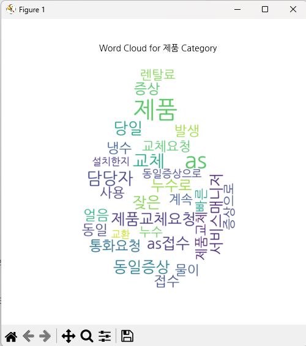

# 💧Coway VoC 워드클라우드 생성 프로그램

📌 고객의 소리(= VoC = Voice of Customer) 데이터를 워드클라우드로 정리하여 한눈에 알아볼 수 있도록 합니다.

## 프로젝트 소개
* ***코웨이 상담사들을 위한 교육 전략의 고도화***를 위해 개발하였습니다.
* VoC 텍스트가 담긴 엑셀 파일을 프로젝트에 넣어 프로그램을 실행하면 카테고리별 워드클라우드가 나타납니다.
* 비기술자도 쉽게 사용할 수 있도록 하단에 프로그램 실행 가이드를 상세히 적어두었습니다.
* 로컬 환경에서 간단히 결과를 확인할 수 있습니다.

## 개발 기간
* 2024.09.24-2024.10.04

## 트러블 슈팅
1. 데이터가 매우 소량인 카테고리
    * **문제** : 데이터가 적어 워드클라우드 생성 시 의미 없는 결과가 나타날 수 있음
    * **원인** : 특정 카테고리에 데이터가 집중되어 있음
    * **해결** : 데이터가 적은 카테고리를 필터링하여 제외

2. 불필요한 단어 출력
    * **문제** : 쓸데없는 단어나 보편적인 단어가 주요 키워드로 나타남
    * **원인** : 불용어 목록에 해당 단어가 포함되지 않음
    * **해결** : `VoC-WordCloud.py`에서 불용어 목록을 추가하여 개선

## 프로젝트 구성

  ```plaintext
  프로젝트 구조
  ├── VoC-WordCloud.py           # 카테고리별 워드클라우드 생성
  ├── text_mining_logistic.py    # 로지스틱 회귀 모델 테스트
  ├── Fonts/                     # 워드클라우드에 사용할 폰트 저장
  │   └── NanumGothic.ttf
  ├── data/                      # 데이터와 이미지 저장
  │   ├── wordcloud_water.png    # 워드클라우드 배경 이미지 (물방울)
  │   ├── input_data.xlsx        # 예제 VoC 데이터
  ├── requirements.txt           # 의존성 목록
  └── README.md                  # 프로젝트 설명
  ```

1. `VoC-WordCloud.py`
	* 카테고리별 워드클라우드를 생성하기 위한 파일
	* `python VoC-WordCloud.py` 를 터미널 창에 입력하면 실행됨
	* 카테고리 개수만큼 윈도우 창이 계속 나타남 (현재 카테고리 개수 9개)
	* 하나의 창을 끄면 다음 창이 나타나는 형식

2. `text_mining_rogistic.py`
	* 카테고리 자동분류 성능테스트 파일
	* SMOTE와 로지스틱 회귀 분류 모델을 사용함
	* 터미널 창에 실행 명령어 입력한 후, 결과가 나올 때까지 시간 오래 걸림 (10-20분 이내)

3. `Fonts` 폴더
	* 폰트 파일 저장 (워드클라우드의 글씨체 변경 가능)

4. `data` 폴더
	* 워드클라우드 배경사진 파일 저장 (물방울 모양, 구름 모양)
	* VoC 데이터 저장

6. 나머지 파일
	* 카테고리 자동분류 성능테스트 파일들
	* 다양한 모델을 사용하여 테스트 해봄
	* 시간이 너무 오래 걸리거나 성능이 너무 떨어져 실행하지 않는 것을 권장함

## 설치방법
>각 프로그램은 가장 최신 버전을 설치하시면 됩니다.

1. VSCode 프로그램 설치

    1-1. [Visual Studio Code 설치하러 가기](https://code.visualstudio.com/download)
	
    1-2. Windows / Mac 중 본인에게 맞는 버전으로 다운로드
	
    1-3. 다운로드 된 .exe 파일 실행하여 프로그램 설치

2. Git 프로그램 설치
	
    2-1. [Git 설치하러 가기](https://git-scm.com/book/ko/v2/%EC%8B%9C%EC%9E%91%ED%95%98%EA%B8%B0-Git-%EC%84%A4%EC%B9%98)

    2-2. Windows / Mac 중 본인에게 맞는 버전으로 다운로드

    2-3. 다운로드 된 .exe 파일 실행하여 프로그램 설치

3. Python 프로그램 설치

    3-1. [Python 설치하러 가기](https://www.python.org/downloads/)

    3-2. Windows / Mac 중 본인에게 맞는 버전으로 다운로드
	
    3-3. 다운로드 된 .exe 파일 실행하여 프로그램 설치

4. VSCode 실행

    4-1. 본인의 컴퓨터에 프로젝트를 위한 새 폴더 생성

    4-2. VSCode 실행 > Open Folder 클릭 > 생성한 새 폴더 선택
	
    4-3. 좌상단 메뉴 중 Terminal > New Terminal 클릭 (단축키 Ctrl + Shift + ` )

5. 프로젝트 Clone

    * Terminal에 아래와 같이 명령어 입력

       `git clone https://github.com/kyoungjini/Coway-Voc-Wordcloud.git`

## 사용법
1. VoC 데이터 삽입
	* 원하는 VoC 엑셀 파일을 data 폴더 안에 추가합니다.
	* `VoC-WordCloud.py` 파일의 `# 엑셀 파일 경로 설정` 부분의 .xlsx 파일명을 수정하세요.  ex) "data/VoC데이터.xlsx"
	* `Ctrl + s` 로 수정사항을 저장하세요.

2. 가상환경 생성 및 활성화
	* Terminal에 아래와 같이 명령어 입력

      `python -m venv venv`

      `venv\Scripts\activate`

		>'/' 아니고 '\\'입니다.

3. 의존성 설치
	* Terminal에 아래와 같이 명령어 입력 (시간이 오래 걸릴 수 있습니다.)

      `pip install -r requirements.txt`

4. 프로젝트 실행
	* Terminal에 아래와 같이 명령어 입력

      `python VoC-WordCloud.py`

5. 워드클라우드를 중간에 끝내고 싶다면?

	* Terminal에 커서를 두고 `Ctrl + c` 를 입력하세요.

5. 데이터 수정
	
    5-1. 워드클라우드 배경 이미지 변경하기
    * 모양이 뚫려 있어야 단어가 모양에 맞춰 나타납니다.
    * 배경 이미지로 원하는 파일을 data 폴더에 추가합니다.
    * `VoC-WordCloud.py` 파일의 `# 마스크 이미지 로드` 부분의 .png 파일명을 수정하세요.  ex) "data/새로운이미지.png"
    * `Ctrl + s` 로 수정사항을 저장하세요.
    * 프로젝트를 실행하여 새로운 결과를 확인해보세요.

	5-2. VoC 데이터 변경하기
	* 원하는 VoC 엑셀 파일을 data 폴더 안에 추가합니다.
	* `VoC-WordCloud.py` 파일의 `# 엑셀 파일 경로 설정` 부분의 .xlsx 파일명을 수정하세요.
	* `Ctrl + s` 로 수정사항을 저장하세요.
	* 프로젝트를 실행하여 새로운 결과를 확인해보세요.

	5-3. 폰트 변경하기
	* 원하는 폰트 파일을 Fonts 폴더에 추가합니다.
	* `VoC-WordCloud.py` 파일의 `# 한글 폰트 경로 설정` 부분의 .ttf 파일명을 수정하세요.
	* `Ctrl + s` 로 수정사항을 저장하세요.
	* 프로젝트를 실행하여 새로운 결과를 확인해보세요.

	5-4. 결과에 불필요한 단어가 있는 것 같다면?
	* `VoC-WordCloud.py` 파일의 `# 한국어 불용어 목록` 부분에 해당 단어를 추가하세요.
	* `Ctrl + s` 로 수정사항을 저장하세요.
	* 프로젝트를 실행하여 새로운 결과를 확인해보세요.

## 결과 예시


## 참고 및 출처
* 참고자료 : [Python 텍스트 마이닝](https://blog.naver.com/hiddenjgrace/222619987673)

## 자주 사용하는 명령어 요약
* 가상환경 생성 : `python -m venv venv`
* 가상환경 활성화 : `venv\Scripts\activate` (Windows) / `source venv/bin/activate` (Mac/Linux)
* 의존성 설치 : `pip install -r requirements.txt`
* 프로젝트 실행 : `python VoC-WordCloud.py`

## 피드백
* 질문은 [Issues](https://github.com/kyoungjini/Coway-Voc-Wordcloud/issues)에 남겨주세요.
